<!-- hero: monochrome ASCII portrait (types in) beside a neofetch-style info
     panel fused with live GitHub stats. regenerate portrait:
       python scripts/prep_photo.py source-image.png && python scripts/make_ascii_svg.py
     the info card + contribution graph refresh daily via
     .github/workflows/update-profile-art.yml (data from scripts/fetch_stats.py) -->

<h3><code>ritessshhh@github ~ $ whoami</code></h3>

<table>
<tr>
<td valign="top"></td>
<td valign="top"></td>
</tr>
</table>

 
 

<h3><code>ritessshhh@github ~ $ ./contributions.sh</code></h3>

